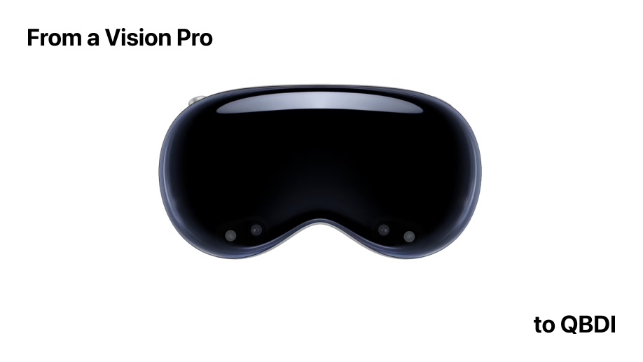

   
   
  

<h3 align="center">From a Vision Pro to QBDI</h4>

This repository contains the material associated with the blog post
[Instrumenting an Apple Vision Pro Library with QBDI](https://www.romainthomas.fr/post/24-09-apple-lockdown-dbi-lifting/)

- [liblockdown.1.dylib](./bin/liblockdown.1.dylib) - `/usr/lib/liblockdown.dylib` **without** de-optimizations
- [liblockdown.2.dylib](./bin/liblockdown.2.dylib) - `/usr/lib/liblockdown.dylib` **with** de-optimizations
